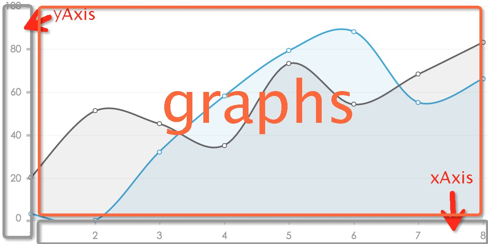
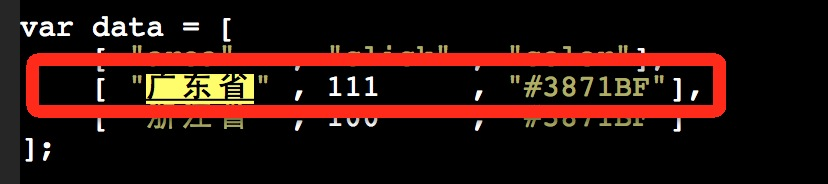
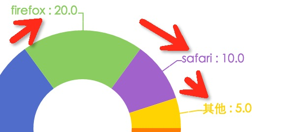
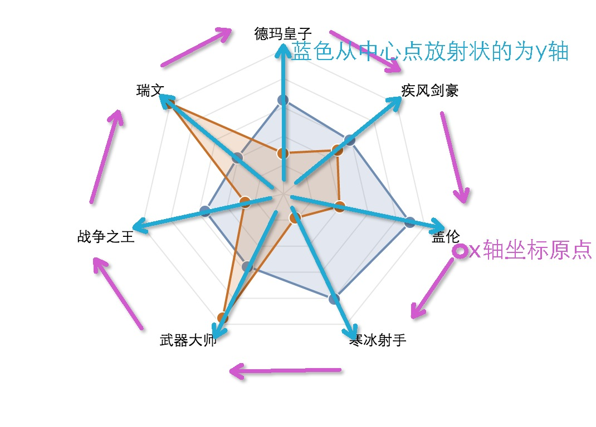
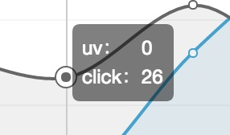
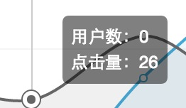

## 简介

Chartx，专业的数据可视化解决方案，一个纯Javascript的图表库，可以流畅的运行在PC和移动设备上，兼容当前绝大部分浏览器（IE6/7/8/9/10/11，chrome，firefox，Safari等），底层依赖自有Canvas渲染引擎<code>Canvax</code>。

支持bar(柱状图)，line（折线图），map（地图），pie（饼图），progress（进度图），radar（雷达图），scat（散点图），topo（拓扑图，树状图），chord（和铉图），hybrid（混搭图表），venn（韦恩图），force（力布局图），还有丰富的原创original（自定义图表）


Chartx线上文件地址：

daily环境为：http:// <code>g-assets.daily.taobao.net/thx/charts/chartx/index[-min].js</code>

cdn环境为 ： http://  <code>g.tbcdn.cn/thx/charts/{{"版本号"}}/chartx/index[-min].js</code>

当前最新CDN版本号为<code>1.9.33</code>。


交流群：

<code>ww交流群 ：1238542386</code>

## 简要名词解析

 这里列举几个高频使用的名词做给简要的解析


 <table>
    <tr><th>名词</th><th>解释</th></tr>
    <tr>
        <td>axis</td>
        <td>直角坐标系中的一个坐标轴，坐标轴可分为类目型、数值型或时间型</td>
    </tr>
    <tr>
        <td>xAxis</td>
        <td>直角坐标系中的横轴，通常并默认为类目型</td>
    </tr>
    <tr>
        <td>yAxis</td>
        <td>直角坐标系中的纵轴，通常并默认为数值型</td>
    </tr>
    <tr>
        <td>zAxis</td>
        <td>直角坐标系中的z轴，通常并默认为数值型，比如在散点图上圆的大小维度</td>
    </tr>
    <tr>
        <td>field</td>
        <td>字段配置，在xAxis,yAxis,zAxis中都必选配置，用来定义该axis从data中取哪列数据</td>
    </tr>
    <tr>
        <td>tip</td>
        <td>图表中的提示框，用来显示更加完整详细的数据</td>
    </tr>
 </table>
   


## 图表

### 折线图(line)

<div id="linelayout">折线图line，柱状图bar，散点图scat等直角坐标系图表的分布都包含xAxis，yAxis，graphs三个区域，如图： </div>

</img>

其中xAxis部分为[xAxis组件](#axis)，yAxis部分为[yAxis组件](#yaxis)，而graphs，则为折线图本身的绘图区域，再graphs区域的底部，你看到的横向竖向的背景线，其实还有一个[back背景组件](#back)。

创建折线图代码 ，<a href="./demo/line/index.html" target="_blank">demo</a> 

 
```js
Chartx.line(#el , data , options);
```

#### 折线图数据

```js
var data= [
    ["xfield","uv" ,"pv","click"],
    [ 1      , 101 , 20 , 33    ],
    [ 2      , 67  , 51 , 26    ],
    [ 8      , 99  , 83 , 51    ]
];
```

#### 折线图配置

```js
var options = {
    xAxis : {}, //x轴组件配置
    yAxis : {}, //y轴组件配置
    back  : {}, //背景组件配置
    anchor: {}, //瞄准器组件配置，可选，不需要瞄准器可以不做配置
    tips  : {}, //tips组件配置
    graphs: {}  //折线图绘图配置
}
```
 options配置，从上面可以看出，一个图表的options，由一系列的组件配置xAxis,yAxis等，和自身的绘图配置组成。比如下面，组件配置部分会有标明。**注：（后续的文档里只会罗列自身绘图配置，组件配置不再说明，因为组件可以适用任何图表）**

 
 + [xAxis（x轴组件配置）](#xaxis)
 + [yAxis（y轴组件配置）](#yaxis)
 + [back（背景组件配置）](#back)
 + [tips（tips组件配置）](#tips)
 + [anchor（十字瞄准组件器配置）](#anchor)
 + [markPoint（标记点组件配置）](#markPoint)
 + [markLine（标记线组件配置）](#markLine)
 + graphs
     - biaxial --> 是否显示双Y轴（只适用yAxis配置了两个指标的情况）
     - line --> 折线的配置
       * enabled --> 是否显示
       * lineWidth --> 线条大小，默认为2
       * strokeStyle --> 可以是一个颜色值，也可以是一个颜色值的数组，也可以是一个自定义函数，[<a href="#color">颜色值的规则</a>]
       * smooth --> 是否显示平滑曲线效果的折线 默认未true
     - node --> 线上的圆点配置
       * enabled --> 是否显示
       * corner  --> 是否再拐角的时候才出现圆点
       * r --> 圆点的半径，默认未2
       * fillStyle --> 默认为白色#ffffff，和line.strokeStyle一样，也可以是值，数组，和自定义函数[<a href="#color">颜色值的规则</a>]
       * strokeStyle --> 默认和line.strokeStyle一致，和同样遵循[<a href="#color">颜色值的规则</a>]
       * lineWidth --> 圆点border大小，默认未2
     - fill --> 填满折线到x轴之间的填充样式配置
       * enabled --> 是否显示填充色，默认为true
       * fillStyle --> 默认和line.strokeStyle一致，遵循[<a href="#color">颜色值的规则</a>]
       * alpha --> 填充色的透明度，如果不需要填充色的折线图可以把该配置设置为0


<span style="margin-top:50px;" id="color">颜色值的配置规则</span>
<table style="margin-left:0;">
    <tr><td style="width:100px;">类型</td><td>描述</td></tr>
    <tr><td>字符串</td><td>返回该值本身</td></tr>
    <tr><td>数组</td><td>会从该数组中根据自身的索引获取对应的数据</td></tr>
    <tr><td>自定义函数</td><td>获取该函数的返回值，该函数的参数为一个{iGroup: , iNode: }对象，其中iGroup变是第几条线的索引，iNode则是x方向第几个节点的索引，适用于配置线上面的圆点。</td></tr>
</table>


#### 折线图事件

请再then promise 中给chart实例添加事件侦听。

```js
Chartx.line(#el , data , options).then(function( chart ){
    chart.on("click mouseover mousemove mouseout" , function( e ){
        if( e.type == "click" ){
            ... do something    
        }
    });
});
```

mobile端事件侦听目前已经全部对接了hammer.js的大部分手势，可以添加tap(点击)， panstart(手势准备移动) ，panmove(手势拖动中)， panend(手势移动结束)。全部手势可以前往[hammer.js](http://hammerjs.github.io/)参考。

##### PC事件  <a target="_blank" href="./demo/line/index_event.html">demo</a>

* click  --> 点击事件
* mouseover --> 进入graphs区域触发
* mousemove --> 再graphs区域移动时触发
* mouseout  --> 离开graphs区域触发

##### Mobile事件 <a target="_blank" href="./demo/line/index_touch.html">demo</a>

* tap --> 手势点击graphs区域触发
* panstart --> 手势点击graphs区域，然后开始移动时触发
* panmove --> 手势在graphs区域移动中触发
* panend --> 手势的移动结束时触发


### 柱状图(bar)

柱状图的[布局和折线图（line）一样](#linelayout)。

创建柱状图代码 ，<a href="./demo/bar/index.html" target="_blank">demo</a> 

 
```js
Chartx.bar(#el , data , options);
```

#### 柱状图数据

```js
var data= [
    ["xfield","uv" ,"pv","click"],
    [ 1      , 101 , 20 , 33    ],
    [ 2      , 67  , 51 , 26    ],
    [ 8      , 99  , 83 , 51    ]
];
```

#### 柱状图配置

```js
var options = {
    ...组件配置
    graphs: {}  //柱状图绘图配置
}
```
 options配置：

 - type --> 可选，如果填写horizontal，则会渲染横向柱状图，默认不配则为纵向柱状图
 + graphs 
   - bar --> 单条bar柱状图形的样式
     *  width --> 单条bar宽度，默认12
     *  fillStyle --> 单条bar的填充色，遵循[<a href="#color">颜色值的规则</a>]
     *  radius --> bar的圆角
   - text --> bar上面的文本
     *  enabled --> 是否显示
     *  fillStyle --> 目前不支持配置，值为"#999"
     *  fontSize  --> 描述文本大小
     *  format --> {function}把原始文本转换座位最终显示文本的转换函数。比如原始数据都是[0.1 , 0.2 , 0.3]，但是实际的显示需要是10%,20%,30%这样的。

            ```js
            graphs : {
                text : {
                    format : function( n ){
                        return n * 100 + "%"
                    }    
                }    
            }
            ```

#### 柱状图事件：

 + click --> 点击事件

 ```js
 bar.on("click" , function(e){
     /*
     *e.eventInfo.iGroup: 分组索引
     *e.eventInfo.iLay:   堆叠索引，-1代表未选择bar
     *e.eventInfo.iNode:  单个分组中，bar索引 -1代表未选择bar 
     */

     //nodesInfoList存放着该事件覆盖的对应节点集合。
     //比如点击bar的分组区域，该nodesInfoList包含了该分组的所有bar矩形.
     //如果点击了具体的某个bar矩形，nodesInfoList则仅包含对应的这个bar矩形
     _.each( e.eventInfo.nodesInfoList , function( info ){
         console.log( info.field+":"+info.value );
     } );
 });
 ```

 

### 地图(map)

地图类型里目前包括有世界地图和中国地图，其中中国地图可以实现省市联动。

demo： <a href="./demo/map/world.html" target="_blank">世界地图</a> <a href="./demo/map/world.html" target="_blank">中国地图</a> <a href="./demo/map/world.html" target="_blank">中国地图省市联动</a>

创建地图代码：

```js
Chartx.map(#el , data , options)
```

#### 地图数据格式

var data = [
    [ "area"   , "click" , "color"],
    [ "广东省" , 111     , "#3871BF"],
    [ "浙江省" , 100     , "#3871BF"]
];

#### 地图配置

```js
var options = {
    mapName : "china" ,//地图类型，默认为china中国地图，world则为世界地图
    areaField : "area" , //areaField字段,默认获取第一个字段，比如上面的data则就是默认area
    area : {}, //地图的单块区域配置样式，比如中国地图是由n个省地图块拼接而成的，area就是中国地图上面单个path比如湖南省地图的样式配置。
    tips : {}
}
```

 - area 
   + strokeStyle --> path区域边框颜色，默认为"white"
   + lineWidth  --> path区域的lineWidth大小，默认为1
   + linkage --> 是否开启省市联动，目前只有mapName为“china”的时候才有效
   + text
     - fillStyle --> 区域名字文本颜色，默认为"#000"
     - enabled --> 是否显示区域名字文本
   + fillStyle --> 单个区域填充色，该配置可以是一个颜色值，也可以是一个函数，如果是函数的话，其参数如下：
     - area --> 单个区域的对象，包括了{id, name , path,}等属性。
     - data --> 假如该区域在data中存在，就代表该行的data数据，比如用上面的数据来渲染中国地图的时候，在绘制"广东省"区域的时候，其fillStyle函数的参数中的data，就是，并且数据已经被结合title序列化成了一个object：

         ```js
         data : {
             area  : "广东省",
             click : 111,
             color : "#3871BF"
         }
         ```

     - dataIndex --> 和data一样，只是dataIndex返回的是该行，在整个data中的行的索引，那么”广东省“的dataIndex就是0（不包含title行）

#### 地图事件

 - areaclick ：点击单块地域触发

 ```js
 map.on("areaclick" , function(e){
     //e.eventInfo 有两个属性
     //e.eventInfo.area 点击的目标area地域对象
     //e.eventInfo.data 该area对应再data中的数据（如果有的话）
 });
 ```


### 饼图(pie)

<a target="_blank" href="./demo/pie/index.html">基础饼图demo</a>

创建饼图代码：

```js
Chartx.pie( #el , data , options );
```

#### pie数据格式：

```js
var data= [
    ["ie"     , 30],
    ["chrome" , 35],
    ["firefox", 20],
    ["safari" , 10],
    ["其他"   , 5]
];
```

TODO：目前pie图的数据格式是唯一不同没有titles行的数据格式，因为再pie里面是默认了第一列座位key字段，后续会统一过来。

#### pie图的配置

- innerRadius --> 内圆半径，默认为0，即为实心饼图
- animation --> 是否执行进场动画
- dataLabel --> 拼图的外接触角tips配置
  + enabled --> 是否显示
  + format --> 格式化模板，比如下面的代码：
 
      ```js
      //周边tip
      dataLabel: {
          enabled: true,
          format: '{point.name} : {point.percentage}'
      }
      ```
    会得到这样的效果  


#### pie图方法

<table>
    <tr>
        <th>方法名称</th>   
        <th>参数</th>   
        <th>描述</th>   
    </tr>
    <tr>
        <td>focusAt(@index)</td>
        <td>@index</td>
        <td>设置第@index位置的扇形为选中状态</td>
    </tr>
    <tr>
        <td>unfocusAt(@index)</td>
        <td>@index</td>
        <td>和focusAt刚好相反，取消第@index位置扇形的选中状态</td>
    </tr>
</table>


#### pie图的事件

 <table>
    <tr>
        <th>事件名称</th>   
        <th>参数</th>   
        <th>描述</th>   
    </tr>
    <tr>
        <td>click</td>
        <td>e.eventInfo.sectorIndex</td>
        <td>点击扇形区域触发事件</td>
    </tr>
    <tr>
        <td>focused</td>
        <td>e.eventInfo.sectorIndex</td>
        <td>hover到扇形区域触获得焦点发事件</td>
    </tr>
    <tr>
        <td>unfocused</td>
        <td>e.eventInfo.sectorIndex</td>
        <td>mouseout扇形区域市区焦点后触发事件</td>
    </tr>
</table>

 


### 雷达图(radar)

雷达图的基本布局：



雷达图的布局和折线图柱状图散点图这样的[xAxis，yAxis，graphs的很清晰的三国分立布局](#linelayout)不一样，但是它也其实也可以理解为是弯曲了的x轴和y轴，就好比一本书，它有着清晰的xy轴的坐标系，但是你把它握成一个圆筒的时候，这个时候它的x轴就成了一个环状。

#### 雷达图的配置

 - graphs 
     + fillStyle  遵循[<a href="#color">颜色值的规则</a>]
     + alpha
     + lineWidth 
    
#### 雷达图的事件

<table>
    <tr>
        <th>事件名称</th>   
        <th>参数</th>   
        <th>描述</th>   
    </tr>
    <tr>
        <td>click</td>
        <td>e.eventInfo.field(该分组对应的字段)</td>
        <td>点击雷达网触发</td>
    </tr>
</table>


### 散点图(scat)

#### 散点图的配置

 - zAxis --> 散点图中的大小维度
    + field zAxis的字段配置，和xAxis,yAxis的field配置一样
 - graphs 
    + maxR --> 最大半径
    + minR --> 最小半径
    + normalR --> 默认半径  
       

### 拓扑图（topo）
    
#### topo配置
 
 - graph 
   + rankdir --> 排序方向，默认“TB”从上到下
   + nodesep --> 节点间距
   + ranksep --> 排间距
 - node 
   + width --> 节点width
   + height --> 节点height
   + fillStyle --> 节点填充色
   + strokeStyle --> 节点描边色
   + strokeStyleHover --> 节点hover态描边色
   + labelColor --> 节点上面文本颜色
 - link
   + 连接线拐点圆角半径

### 进度图表（progress）

#### progress图配置

  - barWidth --> bar宽
  - axisWidth --> 轴宽，默认等于barWidth
  - progColor --> bar的颜色
  - startAngle --> 起始角度
  - angleCount --> 角度的总长
  - currRatio --> 当前的进度比率
  - barDis --> 如果有多组progress，则代表两bar之间的间距
  - field --> 配置哪组数据做为数据源，可以是数组
  - dataType --> 默认是占比，如果是绝对值"absolute"则需要自己另外计算占比
  - text 
     - enabled --> 是否显示文案
     - fillStyle --> 文案背景色
     - format --> 文案过滤函数
     - fontSize --> 文案大小


### 和旋图（chrod）

  和旋图的使用请参考[demo](demo/chord/index.html)

### 韦恩图（venn）

#### venn图配置

 - padding --> 绘图区域的边距，默认15
 - nodeField --> 节点字段配置
 - valueField --> 值字段配置
 - labelField --> 文案字段配置
 - text 
   + enabled --> 是否出现文案
   + fillStyle --> 文案颜色
   + fontSize --> 文案大小
   + textAlign --> 文案左右对齐配置
   + textBaseline --> 文案垂直对齐配置
   + format --> format格式函数
 - circle 
   + fillAlpha --> 圆透明度，默认0.25
   + fillStyle --> 圆填充色
   + strokeStyle --> 圆描边色
   + lineWidth --> 圆边框大小，默认2

### 混合图（hybird）

#### 柱折混合图

  - type --> "bar_line" 所有的混合图表都采用配置type为“charType1_chartType2”的格式
  - yAxis --> 
    + bar --> bar的yAxis配置
    + line --> line的yAxis配置

  ...其他的配置都沿用bar和line的现有配置不变，可以参考[配置了均线的demo](demo/hybrid/bar_line_markline.html)


### 自有原创图表
 - [sector扇形一维比例图](#sector)
 - [thermometer温度计占比图](#thermometer)
 - [planet标签星系图](#planet)
 - [relcontrast多触点关联图](#relcontrast)
 - [relcircle环形关联图](#relcircle)
 - [flowall等比流失图](#flowall)
 - [flowinout等量流失图](#flowinout)


#### <span id="sector">sector扇形一维比例图</span>，[demo](demo/original/sector/index.html)

实例：

```js
var data= [
    ["xfield0","xfield","yfield"],
    [2,50,'b'],
    [3,30,'c'],
    [1,17,'d'],
    [4,100,'a']
];

//chart的配置信息
var options = {
    type : 'sector',
    yAxis : {
        field : 'yfield'
    },
    xAxis : {
        field : "xfield0"
    }
};
//Chartx.funnel开始初始化chart实例
var chartx = Chartx.original("canvasTest" , data , options);

chartx.then(function( sector ){
    sector.on( "complete" , function( e ){
        console.log('aaa')
    });
});
```

#### <span id="thermometer">thermometer温度计占比图</span>，[demo](demo/original/sector/index.html)

 配置：

 - type --> "thermometer"
 - field --> 配置字段
 - dis  --> 设置绘图区域的内边距（padding）
 - graphs 
   + icon 
     - content --> icon的内容，函数。
   + fillStyle 填充色
   + back 
     - fillStyle 背景色
   + text 
     - fillStyle 文本填充色
     - format 文本格式化函数

 实例：

```js
var data= [
    ["scale1","scale2"],
    [70,100],
    [20,30],
    [10,10]
];

//chart的配置信息
var options = {
    type  : "thermometer",
    field : ["scale2"],

    dis   :{
        left : 50
    },
    
    graphs: {
        icon : {
            content : function(e){
                var groups = [ "男" , "女" , "家庭" ]
                return groups[e.index]
            }
        }
        //sDisXAndItemW : 1
        //fillStyle : ['#0098d8','#ff633d','#7867b4'],
        //back :{
          //  fillStyle : ['#f3f3f5','#f3f3f5','#f3f3f5']
        //},
        //text : {
          //  fillStyle : '#ff0000',
          //  format : function(){
          //      return '100%'
          //  }
        //}
    }
    
};
//Chartx.funnel开始初始化chart实例
var chartx = Chartx.original("canvasTest" , data , options);

chartx.then(function( thermometer ){
    thermometer.on( "complete" , function( e ){
        console.log('aaa')
    });
});

```

#### <span id="planet">planet标签星系图</span>，[demo](demo/original/)

 - type --> "planet"
 - cx --> 圆心坐标x
 - event 
   + enabled --> 是否有事件响应(tips)[1]
   + on --> 事件处理函数，参数e ，e.ringID = 第几个环(从0开始 0 = 品牌)   e.ID = 第几个行星(从1开始)
 - yAxis 
   + field --> y轴
 - xAxis 
   + field --> x轴
   + bar 色阶条
     - enabled --> 是否显示
     - y  
     - x
     - width
     - fillStyle --> 色阶渐变的起始和结束颜色值
     - text 
       + contents --> 色阶条两边的文案
 - graphs
   + disY --> //行星与容器上、下之间的最小距离
   + minR --> //行星圆最小半径
   + size 
     - field --> 大小维度的字段
   + layout --> 布局
     - mode --> 模式(0 = 根据yAxis.field计算比例  |  1 = 上下错开)
   + info 
     - field 
     - content
   + core --> 品牌
     - r 
       + normal --> 默认的品牌半径
     - text 
       + content --> 品牌文案
   + text
     - fillStyle
       + normal --> 默认的文本颜色


#### <span id="relcontrast">relcontrast多触点关联图</span>，[demo](demo/original/rel-contrast/index.html)

 - type --> "relcircle",
 - graphs 
   + w --> 绘图区域的width
   + h --> 绘图区域的height
   + groupSort --> 是否做排序
   + node
     - maxR --> 节点最大半径
     - minR --> 节点最小半径
   + edge
     - maxLineWidth --> 连接线最大LineWidth
     - minLineWidth --> 连接线最小LineWidth


#### <span id="relcircle">relcircle环形关联图</span>，[demo](demo/original/relcircle/index.html)

  - type --> "relcircle"
  - graphs
    + w  --> 绘图区域的width
    + h  --> 绘图区域的height
    + groupSort --> 是否做排序 
    + node     
      -  r --> 节点半径
      -  fillStyle --> 节点颜色
    - edge      
      +  lineWidth --> 连接线lineWidth
      +  fillStyle --> 连接线颜色


#### <span id="flowall">flowall等比流失图</span>，[demo](demo/original/flowall/index.html)

   - type --> "flowall"
   - graphs 
     + w --> 绘图区域的width
     + h --> 绘图区域的height
     + node 
       - text
         + format --> function( v ){ }
         + formatVal --> function(v){return v}
         + fillStyle --> 文本颜色
         + fontSize --> 文本大小
         + valFontSize --> val值的文本大小

#### <span id="flowinout">flowinout等量流失图</span>，[demo](demo/original/flowinout/index.html)

 - type --> "flowinout"
 - graphs 
   + w --> 绘图区域的width
   + h --> 绘图区域的height
   + node 
     maxW --> 节点最大width
     maxH --> 节点最大height
     minH --> 节点最小height
     marginTop --> node的上边距
     fillStyle --> 节点的颜色，可以是个数据和处理函数，如果是函数的话，参数为一个node节点对象


## 组件


<h3 id="xaxis">xAxis</h3>

 + enabled --> 是否显示xAxis组件
 - line --> 刻度线
   + enabled --> 是否显示刻度线
   + width -->   刻度线的width，默认为1
   + height -->  刻度线的height，默认为4
   + strokeStyle --> 刻度线的strokeStyle线条颜色
 - text --> 标识文本
   + fillStyle --> 文本的颜色，默认为"#999"
   + fontSize --> 字体大小，默认12px
   + rotation --> 文本以右上角做坐标原点的旋转角度，默认为0代表不旋转
   + format --> <span id='xaxisformat'>{function}一个用来把原始元数据转换到最终展示的文本的转换函数，比如，代表一个星期的数据，元数据是0,1,2,3,4,5,6,7，但是xAxis轴上面需要显示为"星期一"，"星期二"，"星期三"，"星期四"，"星期五"，"星期六"，"星期天"。这个format函数的参数便是每一个元数据，比如是判断参数为0，就return “星期一”。</span>

         ```js
         xAxis : {
             text : {
                 format : function( v ){
                     if( v == 0 ){
                         return "星期一"    
                     }
                 }  
             }    
         }
         ```

   + textAlign --> 文本的横向对齐方式，默认为center，可选left，right
 - filter --> 过滤器，该过滤器和text.format不同，filter是依次来处理每个单元的line 和text，可以非常方便的来自定义ui层面的结构，比如，还是周一到周五，如果我只需要显示周一周三周五周天，那么我们可以这样。

     ```js
     xAxis : {
         filter : function( param ){
             //filter的参数params为一个obj
             //{
             //    layoutData  : arr, 轴上所有显示中的节点列表[ { content :  , x :  } ... ]
             //    index       : a,   layoutdata 中的每个节点对应的索引
             //    txt         : txt, 节点上的txt
             //    line        : line || null 节点上的刻度线
             //}
             if( (param.index+1) % 2 == 0 ){
                 //2,4,6 visible = false
                 param.txt.context.visible = flase;
             }
         }    
     }
     ```


<h3 id="yaxis">yAxis</h3>

 + enabled --> 是否显示yAxis轴组件
 - line    --> yAxis轴刻度线
   + enabled --> 是否显示刻度线
   + width -->  刻度线的width，默认为6
   + lineWidth  -->  刻度线的粗细，默认为3
   + strokeStyle --> 刻度线的颜色，默认为'#BEBEBE'
 - text --> yAxis轴的文本
   + fillStyle --> 文本颜色，默认“#999”
   + fontSize --> 文本大小，默认12px
   + format    --> 和[xAxis.text.format](#xaxisformat)一样
 + filter --> 和xAxis.filter同样的功能，唯一不同的是，params.layoutData的内容，需要注意的是layoutData每个节点中的y坐标值，是 [0 , -10 , -20 .. ]

     ```js
      yAxis : {
         filter : function( param ){
             //filter的参数params为一个obj
             //{
             //    layoutData  : arr, 轴上所有显示中的节点列表[ { content :  , y :  } ... ]
             //    index       : a,   layoutdata 中的每个节点对应的索引
             //    txt         : txt, 节点上的txt
             //    line        : line || null 节点上的刻度线
             //}
         }    
     }
     ```

<h3 id="back">back</h3>


 - enabled --> 是否显示背景
 - xOrigin --> 原点开始的x轴线
   + enabled --> 是否显示
   + lineWidth --> 线的lineWidth
   + strokeStyle --> 线颜色
 - yOrigin --> 原点开始的x轴线
   + enabled --> 是否显示
   + lineWidth --> 线的lineWidth
   + strokeStyle --> 线颜色
 - xAxis  --> x轴方向上的线
   + enabled --> 是否显示
   + lineType --> 默认为实线，可选（dashed 虚线）
   + lineWidth --> 线大小
   + strokeStyle --> 线颜色，默认“#f5f5f5”
   + filter --> 过滤函数，用来定制每条线条的样式。

         ```js
         back : {
             xAxis : {
                 filter : function( param ){
                     //param为一个包含了yAxis组件layoutData 以及该条件再layoutData中的索引，和着条line的canvax实例
                     //{
                     //   layoutData : self.yAxis.layoutData,
                     //   index      : a,
                     //   line       : line
                     //}
                     // 比如，我们要把第一条线隐藏，第二条线设置为红色
                     if( param.index == 0 ){
                         param.line.context.visible = false;    
                     }
                     if( param.index == 1 ){
                         param.line.context.strokeStyle = "red";    
                     }
                 }    
             }    
         }
         ```

 - yAxis  --> y轴方向上的线
   + enabled --> 是否显示
   + lineType --> 默认为实线，可选（dashed 虚线）
   + lineWidth --> 线大小
   + strokeStyle --> 线颜色，默认“#f5f5f5”
   + filter --> 过滤函数，和上面的back.xAxis.filter功能一致，用来定制每条线条的样式。

         ```js
         back : {
             yAxis : {
                 filter : function( param ){
                     //param为一个包含了xAxis组件layoutData 以及该条件再layoutData中的索引，和着条line的canvax实例
                     //{
                     //   layoutData : self.xAxis.layoutData,
                     //   index      : a,
                     //   line       : line
                     //}
                     // 比如，我们要把第一条线隐藏，第二条线设置为红色
                     if( param.index == 0 ){
                         param.line.context.visible = false;    
                     }
                     if( param.index == 1 ){
                         param.line.context.strokeStyle = "red";    
                     }
                 }    
             }    
         }
         ```

<h3 id="anchor">anchor(十字坐标瞄准器)</h3>


上图的红色十字坐标瞄准器就是anchor组件，<a href="./demo/line/anchor.html" target="_blank">该图表demo点这里</a>

 - w --> anchor的区域width
 - h --> anchor的区域height
 - enabled --> 是否显示
 - xAxis
   + lineWidth --> x轴线的lineWidth
   + fillStyle --> x轴线的fillStyle，默认为“#cc3300”
 - yAxis
   + lineWidth --> y轴线的lineWidth
   + fillStyle --> y轴线的fillStyle，默认为“#cc3300”
 - node --> 坐标交叉点的圆点
   + enabled --> 是否需要显示圆点
   + r  --> 圆点半径
   + fillStyle --> 圆点的填充色，默认为“#cc3300”
   + strokeStyle --> 圆点的描边颜色，默认为“#cc3300”
   + lineWidth --> 圆点描边的lineWidth
 - pos --> anchor区域的原点坐标
   + x 
   + y
 - cross --> 十字交叉点的坐标
   + x 
   + y

<h3 id="tips">tips</h3>

 - backR --> tip框圆角大小
 - fillStyle --> tip框背景色，默认"#000000"
 - text
   + fillStyle --> tip内容文本颜色，默认"#ffffff"
 - alpha --> tip框透明度
 - offset --> tip框到鼠标位置的偏移量
 - prefix --> 假如yAxis.fields配置为[ "uv" , "click" ]，那么这个时候的tip内容为这样，给tips.prefix配置为["用户数","点击量"]后，那么结果会是这样
 - content --> {function}如果tips配置了content的话，那么tip框内的内容都会是content函数的返回内容，这个时候prefix会失效。content函数的参数详情如下
   + 折线图(line)，柱状图(bar)，散点图(scat)中的tips content 函数参数：

     <table>
         <tr>
             <td>xAxis</td>
             <td>
                 tip点位置对应的x轴数据。{ field : "xAxis的field配置" , value : "对应xAxis的value值" }
             </td>
         </tr>
         <tr>
             <td>iGroup</td>
             <td>对应yAxis轴方向第几组数据，比如折线图中代表第几条折线</td>
         </tr>
         <tr>
             <td>iNode</td>
             <td>对应xAxis轴上第几个节点，比如折线图中代表线条的第几个节点</td>
         </tr>
         <tr>
             <td>nodesInfoList</td>
             <td>
             [ { field : "这个节点对应的yAxis字段field" ,alpha: , color:  , fillStyle: , lineWidth: , r: , strokeStyle: , value: , x: , y: , } ... ]
             </td>
         </tr>
     </table>
  
   + 地图(map)中的tips content 函数参数：
     - area //目标地域对象
     - data //目标地域在data中的数据，如果有的话，否则data属性不存在
     - dataIndex //目标地域在data中索引值，如果有的话，否则dataIndex属性不存在


   <h3 id="markpoint">markPoint</h3>

   - markTarget --> markpoint标准的对应元素
   - point --> markpoint的位置
     + x
     + y
   - shapeType --> markpoint的图形类别，目前有支持circle圆形和droplet水滴型，默认为“circle”
   - fillStyle --> 填充色
   - strokeStyle
   - lineWidth
   - globalAlpha
   - duration --> 如果有动画，则代表动画时长
   - duration --> 动画类型
   - hr --> 如果是水滴形的话，描述水滴型的横向半径
   - vr --> 如果是水滴形的话，描述水滴型的纵向半径
   - r  --> 如果是圆形的话，描述圆形半径
   - realTime --> 是否是实时的一个点，如果是的话会有动画
   - tween --> realTime为true的话，tween则为对应的一个缓动对象
   - filter --> 过滤函数

   <h3 id="markline">markLine</h3>

   - field --> markLine对应的yAxis的field字段
   - origin --> markLine的原点
   - line 
     + y --> line基于原点的y值
     + list --> pointList集合
     + strokeStyle
     + lineWidth 
     + lineType --> 默认为虚线“dashed”
   - filter --> 过滤函数
