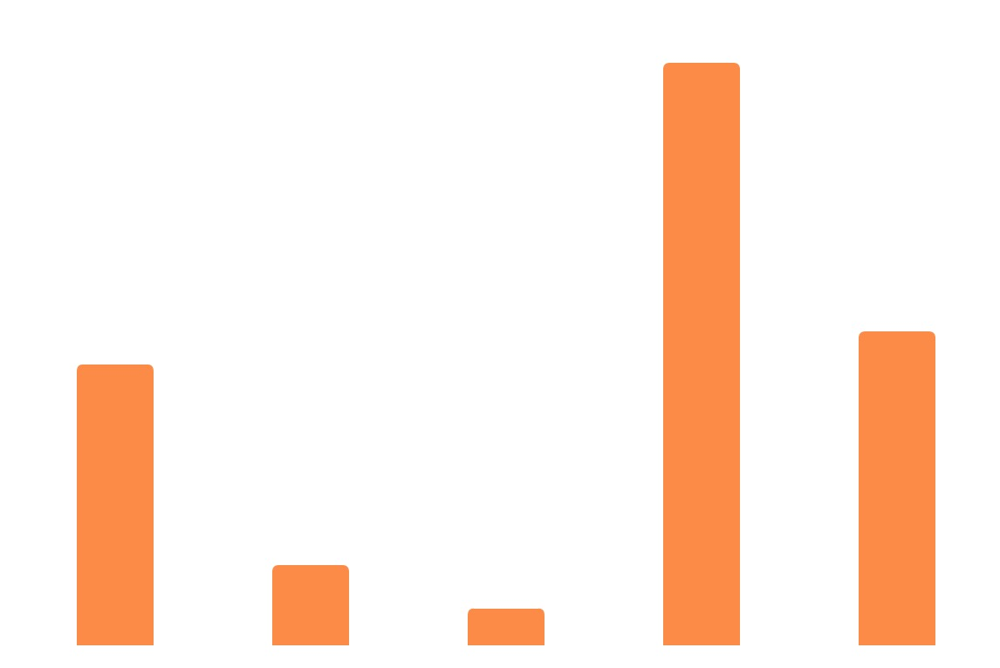

Chartx对图表的理解
=================

近几年前端领域风起云涌，数据可视化界也还算热闹，除了上古时期的googleChart,D3,hightChart等，还有不少的新的图表库异军突起，每个图表库的出现都不纯粹的是重复造轮子，都代表着自己对图表的理解，都有着自己的脾性。

我们来通过解读Chartx如何建立一个简单的图表，来向你描述我们对图表的理解。

Chartx是一个基于`组件化`开发的图表库，我们把图表从ui层面拆分为一个个组件，然后统一管理，对应的，我们的配置也是和组件一一对应的。

`数据可视化`，那么首先是要有`数据`，我们用来描述一个图表，必须要有数据，和配置两部分，但是数据是纯粹的数据，没有任何的逻辑意义，来看下Chartx中的数据，我们所有图表的数据都是统一的数据格式，加入我们已经准备好了如下的数据：

`Chartx中的标准数据格式`

```javascript
var data = [
    { "time": "2017-03-21", "pv": 10, "uv": 12, "click": 112, "ppc": 45 },
    { "time": "2017-03-22", "pv": 20, "uv": 32, "click": 122, "ppc": 35 }
];
```

`有了数据，我们来看Chartx如何绘制一个简单的图表吧`

>  比如，我们要创建一个柱状图，我们可以这么分解一下，一个柱状图是基于直角坐标系的，然后在坐标系上面绘制了一个柱形图。那么，我们就需要至少两个组件，一个坐标系组件（type==rect），一个图形组件（type==bar）。

`直角坐标系`


`柱状图元素`



`转换到对应的配置就是这样的：`

```javascript
var options = {
    coord: { //配置一个coord坐标系组件
        type: "rect", //这个组件的type是rect(直角坐标系)，另外还有polar（极坐标）可选
        xAxis: { //直角坐标系的x轴是必选
            field: "time" //设置哪个数据字段来作为x轴
        }
    },
    graphs: { //配置一个绘图组件
        type: "bar", //告诉系统这个绘图的类型是bar（即柱状图）
        field: "uv" //然后拿哪个数据字段来绘制这个柱状图形
    }
}
```

整个图表全部由这个options来描述，而这个options的全部一级的key配置，则对应着一个组件，于是整张图表就像一列火车，由一节一节的车厢组成，而每一个车厢，则表示一个组件，对于基于坐标系绘制的图表，那么坐标系组件就是第一组件必须要配置的，就是这列火车的车头。

然后如果你要添加其他组件进来比如上面这个最基础的折线图，你还要添加一份Legend(图例),和tips组件，那么就是这样了：

```javascript
var options = {
    coord: { 
        type: "rect", 
        xAxis: { 
            field: "time" 
        }
    },
    graphs: { 
        type: "bar", 
        field: "uv" 
    },
    legend : { ... }, //组装上legend组件
    tips : { ... } //组装上tips组件
}
```

另外，如果你要绘制的是一个柱状+折线的混合图表，那么怎么办呢

`要做混合图表怎么办，比如柱折混合图`


这里我们的理解是，一个叫graphs的车辆里，坐着两个人，一个叫bar，一个叫line

```javascript
var options = {
    coord: { 
        type: "rect", 
        xAxis: { 
            field: "time" 
        }
    },
    graphs: [ //在Chartx里，绘图组件这个车箱里，如果坐了多个人，那么请把它配置为一个数组[]
        { 
            type: "bar", //一个身份是bar的图形
            field: "uv"  //它的名字是uv
        },
        { 
            type: "line", //一个身份line的图形
            field: "pv"  //它的名字是pv
        }
    ]
}
```

到这里，你基本已经了解了Chartx了。

[是时候看下快速入手把Chartx接入到你的项目了](./start.html)

#### License

Chartx is available under the <a href="http://opensource.org/licenses/MIT" target="_blank">MIT license</a>.