## 折线图

    <a target="_blank" href="./demo/line/index.html">
    <dl class="chart">
        <dt>
        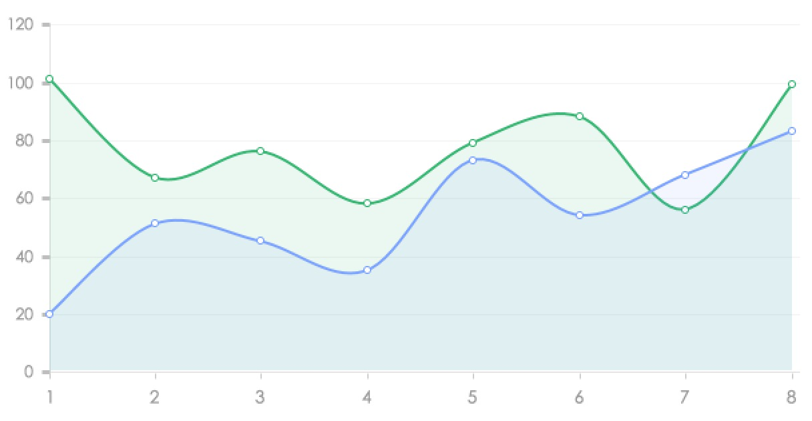
        </dt>
        <dd>
            <h5>
            基础折线图
            </h5>
            
            全部默认配置
            
        </dd>
    </dl>
    </a>

    <a target="_blank" href="./demo/line/add_remove_line.html">
    <dl class="chart">
        <dt>
        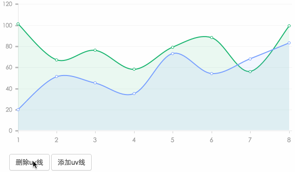
        </dt>
        <dd>
            <h5>
            添加，删除折线
            </h5>
        </dd>
    </dl>
    </a>

    <a target="_blank" href="./demo/line/xAxis_rotate.html">
    <dl class="chart">
        <dt>
        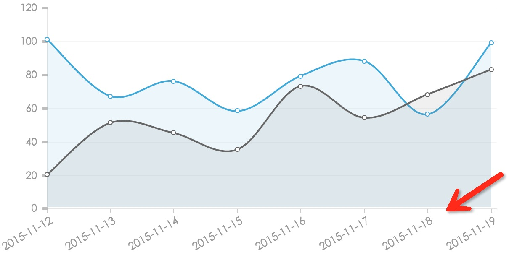
        </dt>
        <dd>
            <h5>
            xAxis旋转
            </h5>
            
            xAxis上面的文字比较长，比如2015-05-12这样的日期的时候，建议采用xAxis的文案旋转
            
        </dd>
    </dl>
    </a>

    <a target="_blank" href="./demo/line/anchor.html">
    <dl class="chart">
        <dt>
        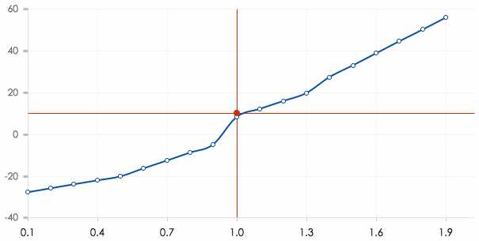
        </dt>
        <dd>
            <h5>
            附带瞄准器的折线图
            </h5>
            
            
            
        </dd>
    </dl>
    </a>

    <a target="_blank" href="./demo/line/corner.html">
    <dl class="chart">
        <dt>
        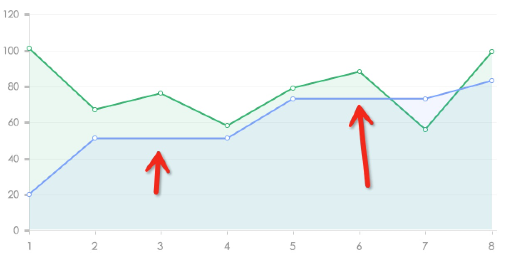
        </dt>
        <dd>
            <h5>
            折线转角才有圆点
            </h5>
            
            在折线上面，只有转角的时候才有圆点，注意，如果在smooth为true的时候，不生效
            
        </dd>
    </dl>
    </a>

    <a target="_blank" href="./demo/line/custom_xyAxis_datasection.html">
    <dl class="chart">
        <dt>
        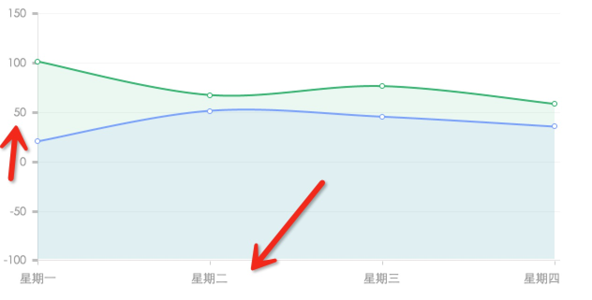
        </dt>
        <dd>
            <h5>
            xAxis和yAxis自定义
            </h5>
            
            可以传入自定义的dataSection来覆盖
            
        </dd>
    </dl>
    </a>

    <a target="_blank" href="./demo/line/fill_gradient.html">
    <dl class="chart">
        <dt>
        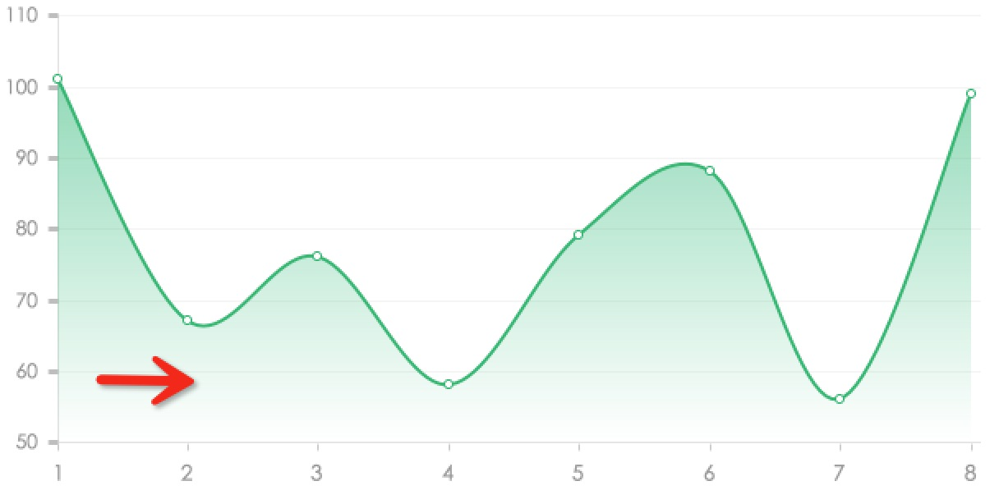
        </dt>
        <dd>
            <h5>
            渐变的填充区域
            </h5>
            
        
            
        </dd>
    </dl>
    </a>

## 柱状图

    <a target="_blank" href="./demo/bar/index.html">
    <dl class="chart">
        <dt>
        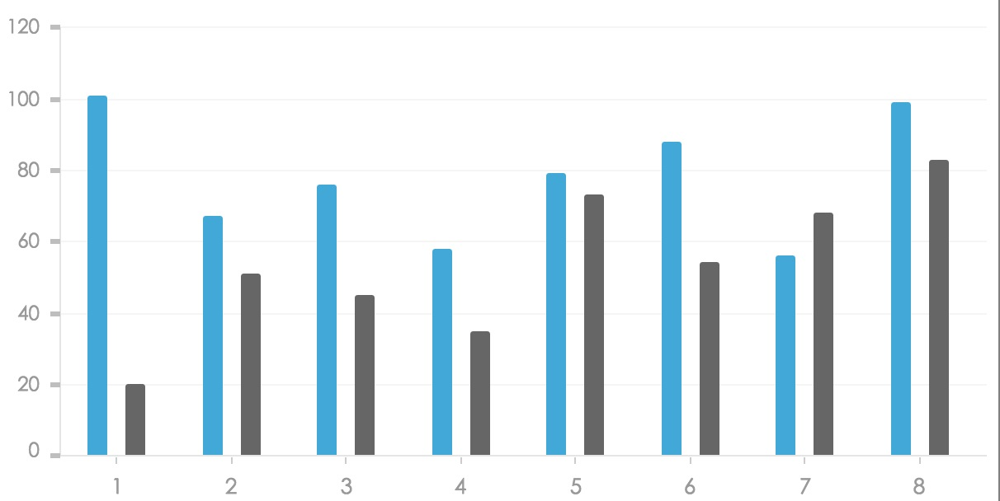
        </dt>
        <dd>
            <h5>
            基础柱状图
            </h5>
            
            全部默认配置
            
        </dd>
    </dl>
    </a>

    <a target="_blank" href="./demo/bar/horizontal.html">
    <dl class="chart">
        <dt>
        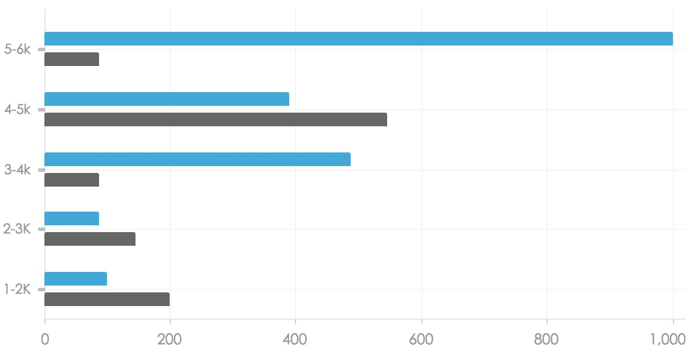
        </dt>
        <dd>
            <h5>
            横向柱状图
            </h5>
        </dd>
    </dl>
    </a>

    <a target="_blank" href="./demo/bar/graphs_info.html">
    <dl class="chart">
        <dt>
        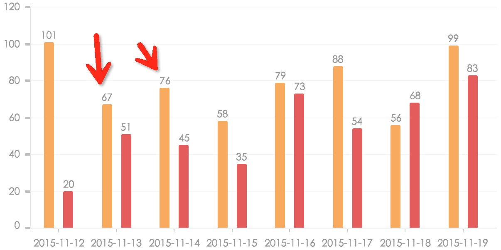
        </dt>
        <dd>
            <h5>
            柱形图上面带描述
            </h5>
            
            y轴的矩形柱上附带对应的数据信息
            
        </dd>
    </dl>
    </a>

    <a target="_blank" href="./demo/bar/horizontal_graphs_info.html">
    <dl class="chart">
        <dt>
        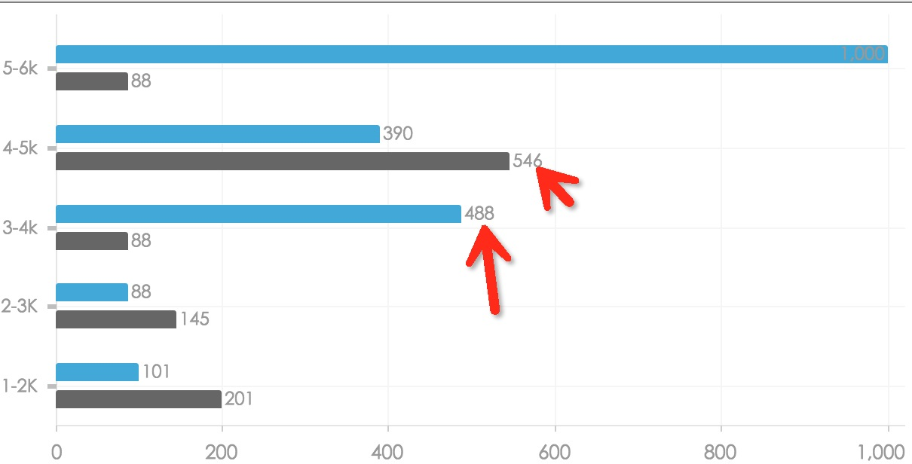
        </dt>
        <dd>
            <h5>
            横向柱形图上面带描述
            </h5>
            
            横向柱形图x轴方向的矩形柱上附带对应的数据信息
            
        </dd>
    </dl>
    </a>

    <a target="_blank" href="./demo/bar/custom_xyAxis_datasection.html">
    <dl class="chart">
        <dt>
        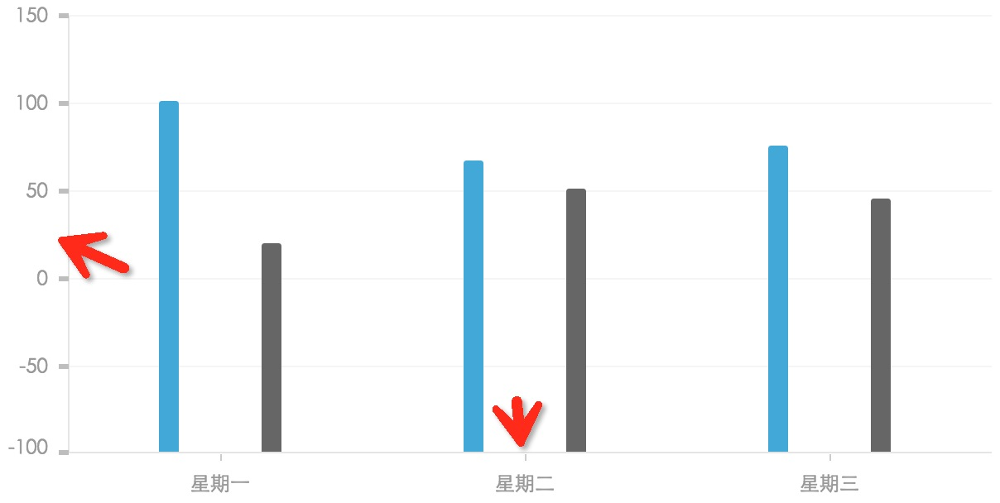
        </dt>
        <dd>
            <h5>
            自定义柱状图的xAxis ，yAxis轴信息
            </h5>
        </dd>
    </dl>
    </a>

    <a target="_blank" href="./demo/bar/single.html">
    <dl class="chart">
        <dt>
        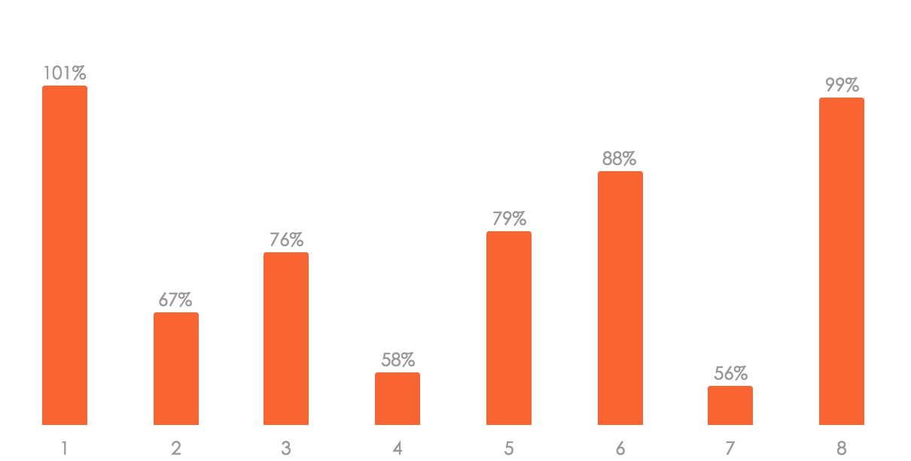
        </dt>
        <dd>
            <h5>
            简单样式的柱状图
            </h5>
            
            没有显示xAxis,yAxis,背景，只有柱状图形区域的简单柱状图
            
        </dd>
    </dl>
    </a>

    <a target="_blank" href="./demo/bar/xAxis_rotate.html">
    <dl class="chart">
        <dt>
        
        </dt>
        <dd>
            <h5>
            xAxis旋转
            </h5>
            
            和折线图一样，当xAxis文案较长，比如2015-05-18这样，建议采用xAxis旋转增加可读性
            
        </dd>
    </dl>
    </a>

## 地图

    <a target="_blank" href="./demo/map/index.html">
    <dl class="chart">
        <dt>
        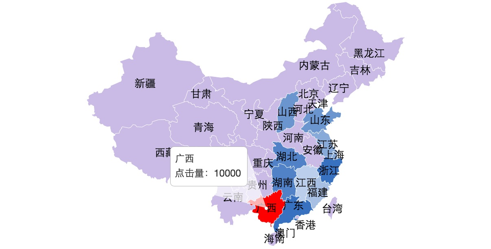
        </dt>
        <dd>
            <h5>
            中国地图
            </h5>
        </dd>
    </dl>
    </a>

    <a target="_blank" href="./demo/map/provinces_linkage.html">
    <dl class="chart">
        <dt>
        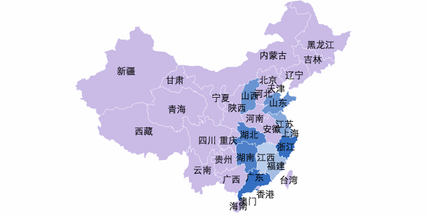
        </dt>
        <dd>
            <h5>
            中国地图省市联动
            </h5>
        </dd>
    </dl>
    </a>

    <a target="_blank" href="./demo/map/world.html">
    <dl class="chart">
        <dt>
        
        </dt>
        <dd>
            <h5>
            世界地图
            </h5>
        </dd>
    </dl>
    </a>

## 饼图

    <a target="_blank" href="./demo/pie/index.html">
    <dl class="chart">
        <dt>
        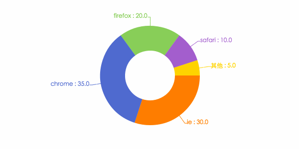
        </dt>
        <dd>
            <h5>
            基础饼图
            </h5>
        </dd>
    </dl>
    </a>

    <a target="_blank" href="./demo/pie/nodatalabel.html">
    <dl class="chart">
        <dt>
        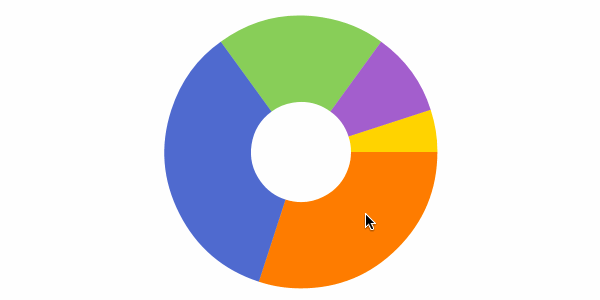
        </dt>
        <dd>
            <h5>
            饼图，无周边tip 
            </h5>
        </dd>
    </dl>
    </a>

    <a target="_blank" href="./demo/pie/solid.html">
    <dl class="chart">
        <dt>
        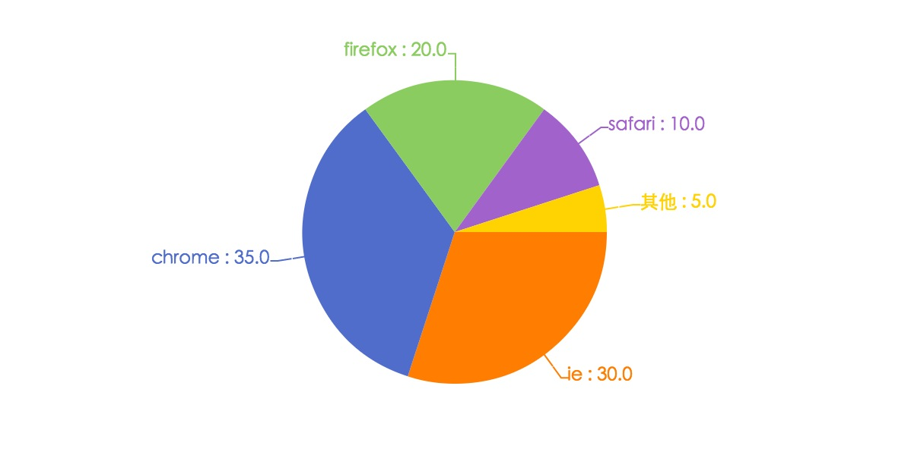
        </dt>
        <dd>
            <h5>
            实心饼图
            </h5>
        </dd>
    </dl>
    </a>

## 雷达图

    <a target="_blank" href="./demo/radar/index.html">
    <dl class="chart">
        <dt>
        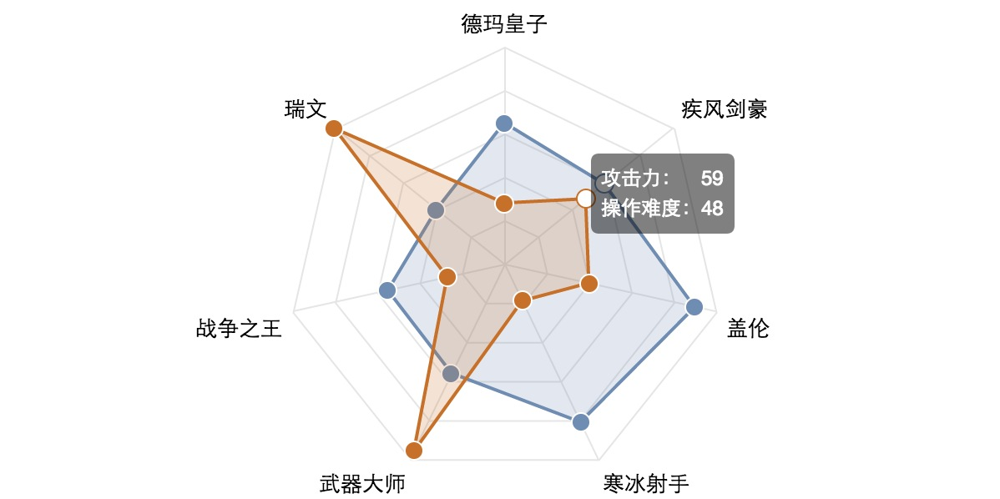
        </dt>
        <dd>
            <h5>
            基础雷达图
            </h5>
        </dd>
    </dl>
    </a>

    <a target="_blank" href="./demo/radar/custom_yAxis.html">
    <dl class="chart">
        <dt>
        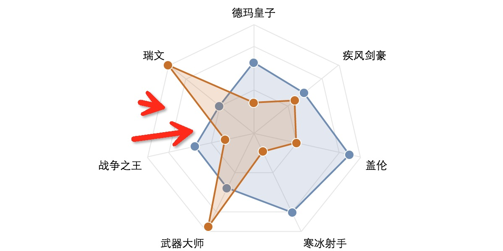
        </dt>
        <dd>
            <h5>
            雷达图，可以自定义y轴维度
            </h5>
        </dd>
    </dl>
    </a>

## 散点图

    <a target="_blank" href="./demo/scat/index.html">
    <dl class="chart">
        <dt>
        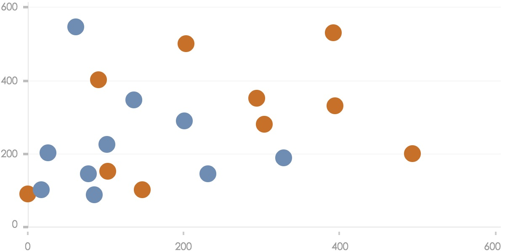
        </dt>
        <dd>
            <h5>
            基础散点图
            </h5>
        </dd>
    </dl>
    </a>

## 拓扑图

    <a target="_blank" href="./demo/topo/tree.html">
    <dl class="chart">
        <dt>
        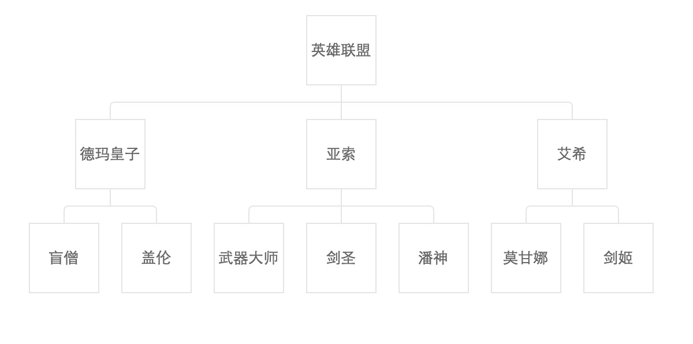
        </dt>
        <dd>
            <h5>
            至上而下的树形图tree
            </h5>
        </dd>
    </dl>
    </a>

    <a target="_blank" href="./demo/topo/tree-h.html">
    <dl class="chart">
        <dt>
        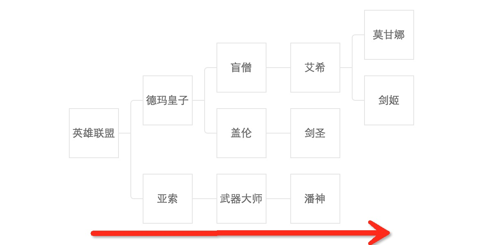
        </dt>
        <dd>
            <h5>
            从左到右的横向树形tree
            </h5>
        </dd>
    </dl>
    </a>

## 力导向布局图

## progress进度图表

## 自有原创图表

### 标签星系图

### 充值+进度图表

